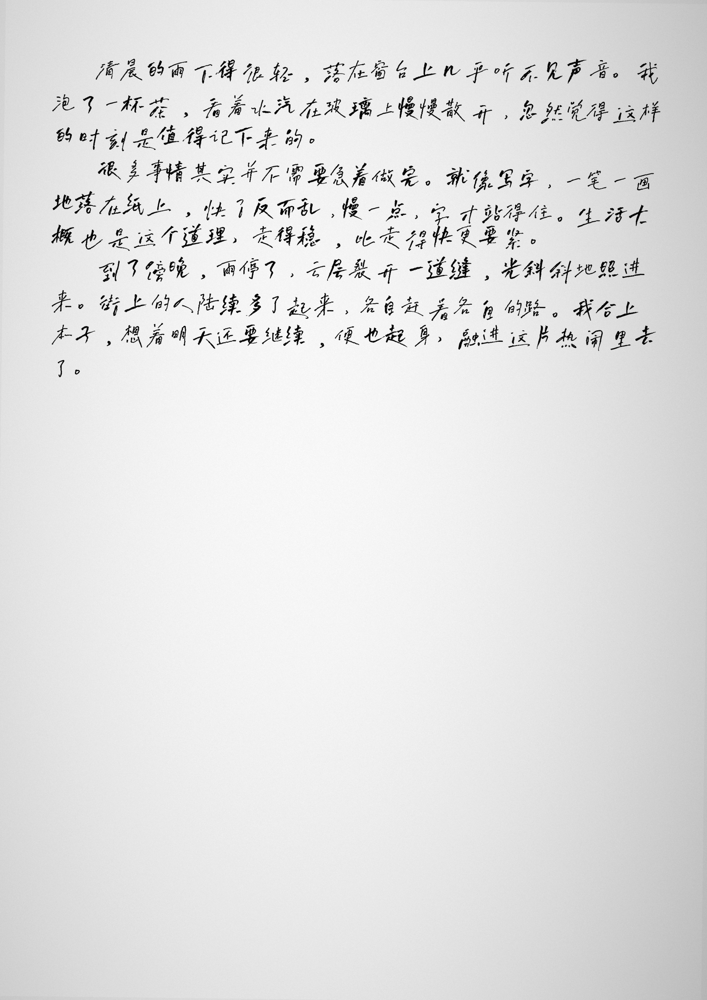

# handwriting-pipeline

把文本渲染成接近真人手写的图片，可叠加扫描质感、合成 PDF。

基于 [handright](https://github.com/Gsllchb/Handright)，在它之上补了两个让结果更像人写的关键改动，并配了一套从文本到"扫描件 PDF"的完整管线。



## 和直接用 handright 的区别

handright 本身已经做了笔画级的随机扰动，但还有两处一眼能看出是程序生成：重复字长得一模一样、每个字独立上下乱跳。这里针对这两点做了改进：

- **多字体逐字混排**：准备同一作者/同一风格的几套字体（比如某位作者的几个手写体版本），渲染时每个字随机挑一套。这样全篇里重复出现的字骨架不同，又因为是同源风格，不会像是几个人轮流写的。
- **相关基线模型**：替换 handright 的逐字定位，改成每行一个轻微斜率加一条缓慢起伏曲线。效果是相邻两字几乎不差、整行基线缓慢漂移、偶尔写斜一行——这才是正常人手写的样子，而不是逐字白噪声那种机器味。

另外还有：

- **扫描质感**（`scan.py`）：转灰度、纸张轻微歪斜、打光不匀、纸面噪点、轻微发虚。每页用不同随机种子，倾斜和打光各页不同，模拟手机一页页分别扫的差异。
- **合成 PDF**（`to_pdf.py`）：多页合到一个 PDF。
- **表单填字**（`fill_fields.py`）：往"学号：____ 姓名：____"那种横线空格里手写填字，整串自动缩放到下划线宽度内。
- **背景生成**（`background.py`）：没有现成稿纸时，生成空白或带横线的 A4。

## 安装

```bash
pip install -r requirements.txt
```

字体不随仓库分发（版权原因），请自备手写字体的 `.ttf`。推荐找同一作者的几套手写体一起用，混排效果最自然。

## 用法

最简单：用示例文本 + 自备的几套字体，渲染到空白 A4 并加扫描质感、合成 PDF。

```bash
python render.py \
  --text examples/sample.txt \
  --fonts /path/font_a.ttf /path/font_b.ttf /path/font_c.ttf \
  --scan --pdf out/result.pdf
```

常用参数：

| 参数 | 说明 |
|---|---|
| `--text` | 输入文本文件 |
| `--fonts` | 一个或多个手写字体（逐字随机混用） |
| `--background` | 背景图片；不给则生成空白 A4 |
| `--ink` | 墨色 `R,G,B`，默认近黑 `18,18,18` |
| `--size` / `--line-spacing` | 字号 / 行距 |
| `--scan` | 叠加扫描质感 |
| `--pdf` | 把所有页合成到这个 PDF |
| `--seed` | 随机种子，换种子换一版排布 |

在自己的稿纸/表单背景上渲染，并往表头空格填字，可参考 `render.py` 的 `render()` 与 `fill_fields.write_field()` 自行组合。

## 模块

| 文件 | 作用 |
|---|---|
| `render.py` | 核心：文本转手写页（多字体混排 + 相关基线），含命令行入口 |
| `scan.py` | 扫描质感 |
| `to_pdf.py` | 多页合成 PDF |
| `background.py` | 生成空白 / 横线 A4 背景 |
| `fill_fields.py` | 表单横线空格手写填字 |
| `install_fonts.py` | Windows 用户级安装字体（无需管理员） |

## 字体安装工具

把一个目录下的手写字体批量装到当前用户（不用管理员，新开的软件即可选用）：

```bash
python install_fonts.py "字体目录" --name 关键词
```

## 说明

本项目是文本排版/手写效果渲染工具，请在合规范围内使用，遵守所在机构的相关规定。字体版权归各自作者所有。

致谢 [handright](https://github.com/Gsllchb/Handright)。
